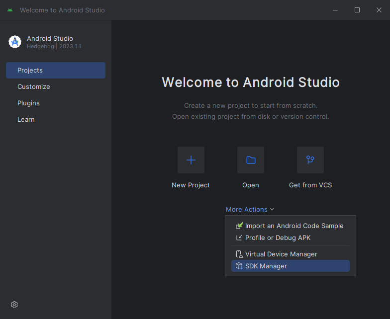
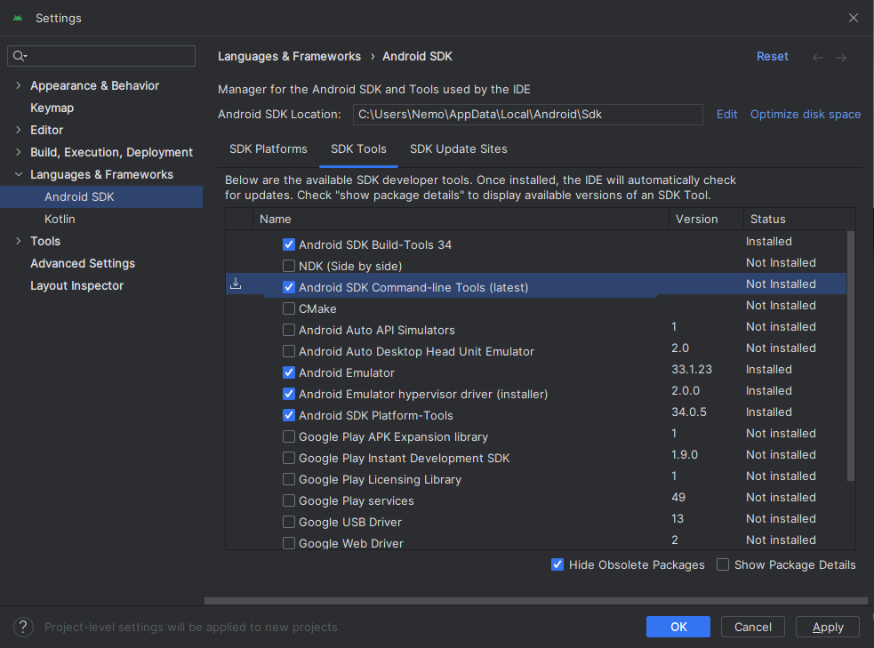

# Android

## Install Windows

`winget install --id Google.AndroidStudio`

## Install Mac

*Requires MacOS 10.14 (Mojave) or higher*

[Download](https://developer.android.com/studio)

Open and drag Android Studio icon into Applications folder.

Follow the instructions.

## Configure SDK

Verify that flutter is able to locate the SDK by running `flutter doctor`.

Open **Android Studio**

### Virtual Android device

Open **Virtual Device Manager**

Create a new virtual Android device by clicking **Create Device**

You should pick something with Play Store enabled. I chose Pixel 2.

Click the small download icon on item with API Level 33.
Wait for it to complete then next.

Finish

Open **SDK Manager**

Check **Android SDK Command-line Tools** and click **OK**.

