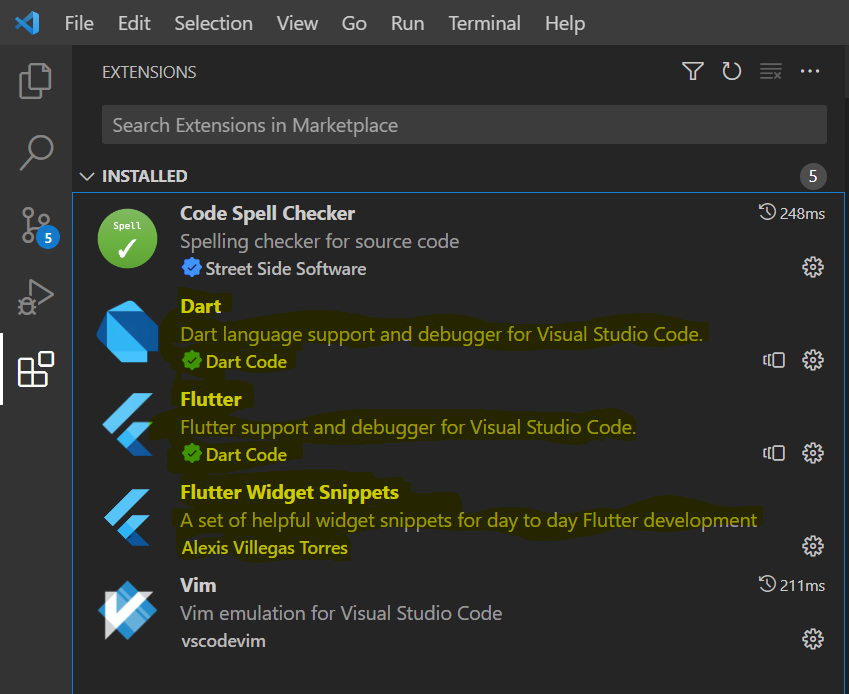

# Flutter Setup on Windows

## Optional

Get **Windows Terminal** from **Microsoft Store**.

Or install using winget from powershell with:
```powershell
winget install --id Microsoft.WindowsTerminal
```

## Install flutter

**Windows+R** -> **powershell**

```powershell
cd path/you/want/flutter/in
winget install --id Git.Git
git clone https://github.com/flutter/flutter.git -b stable

pwd
```

Remember the path in output from last command.

Now we need to let the OS know where **flutter** binary is located.

Press **Windows** button.
Type **environment**.
Select **Edit the system environment variables**.


Click **Environment Variables**


Click **Edit** for **Path** variable.


Insert the path from output above and add `\bin` to the end.

Reboot!

Open powershell again and type `flutter doctor`.

If Chrome is missing then you can install it with:
```powershell
winget install --id Google.Chrome
```

## Visual Studio Code

If Visual Studio Code is missing then you can get in with:
```powershell
winget install --id Microsoft.VisualStudioCode
```

Install the highlighted (yellow) extensions.


