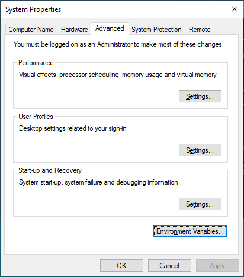
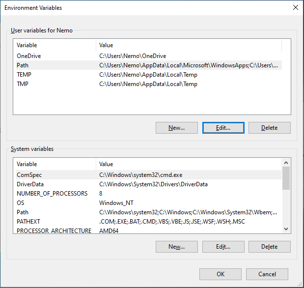
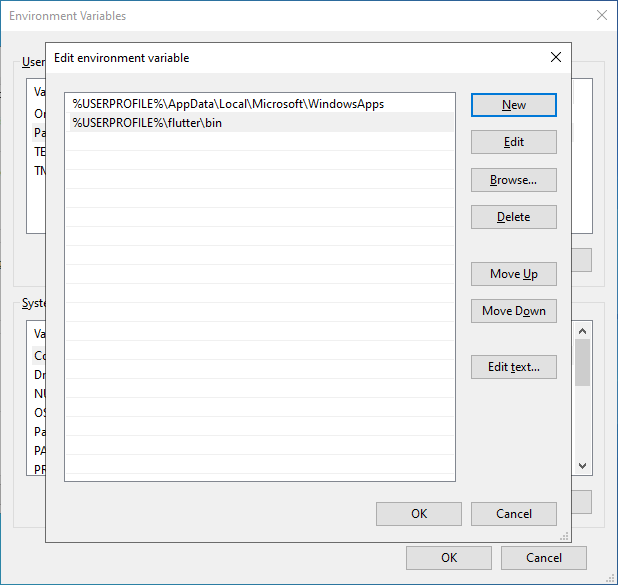

# Flutter Setup on Windows

## Install flutter

Open "GIT Bash"

```sh
cd ~
git clone https://github.com/flutter/flutter.git -b stable
```

Now we need to let the OS know where **flutter** binary is located.

*You might need to translate if you OS is in a different language.*

Press **Windows** button.
Type **environment**.
Select **Edit the system environment variables**.

You should see a window this:



Click **Environment Variables**



Click **Edit** for **Path** variable.



Click **New** and type `%USERPROFILE%\flutter\bin`

**OK** all the windows to close them.

---> Reboot! <---

Open "GIT Bash" and run `flutter doctor`

If Chrome is missing (as in screenshot), then install it to its default location.


Don't worry about the other issues for now.

[Continue](./android.md)